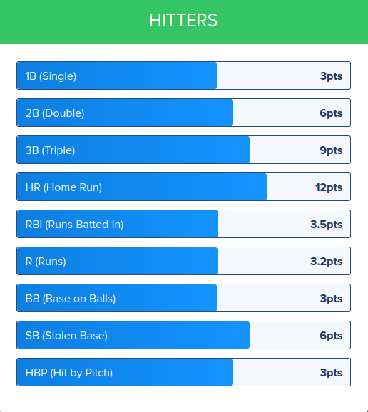
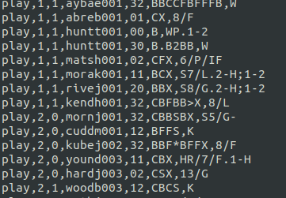
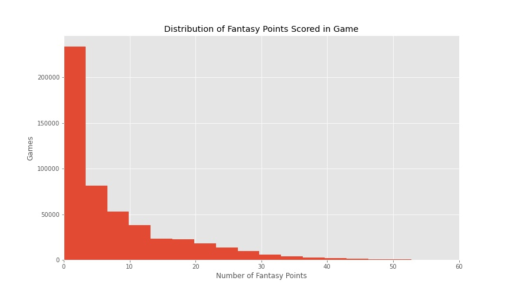
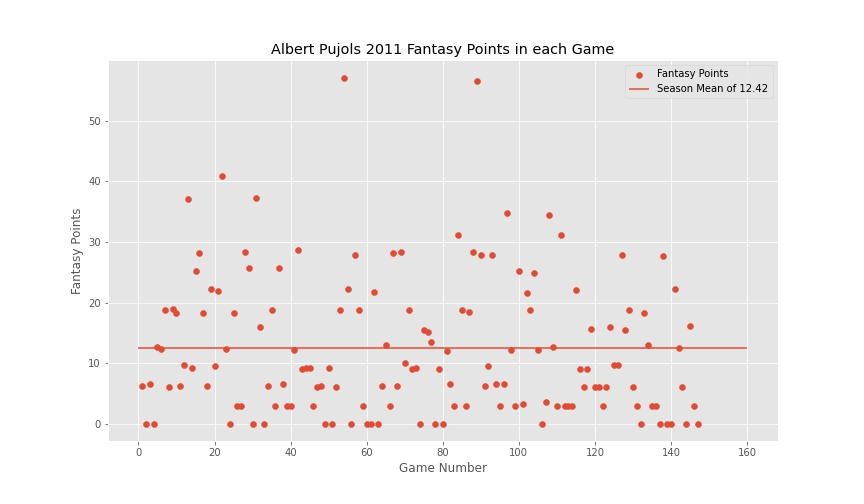
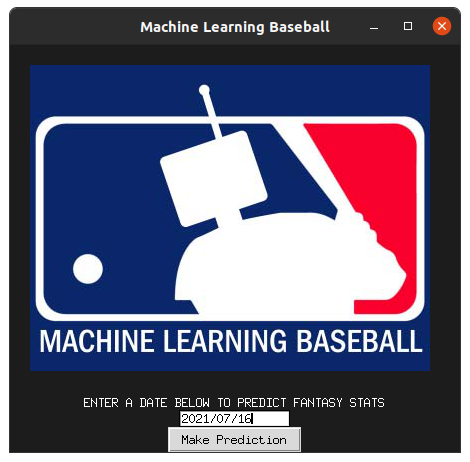

# **Machine Learning Baseball**

## **Background**

Fantasy baseball is a game in which players pick actual MLB players that they believe will perform well in a game and score fantasy points based on how well those player play in a particular game. If the players you chose get more fantasy points than the players your opponent chose, then you win the match. I decided to use the scoring system used by [Fan Duel](https://www.fanduel.com/fantasy-baseball) when making these predictions. The points awarded for each event are explained in the following image.

For this project I will only focus on batters as they are the hardest to predict.  

---

## **Dataset**
I wanted to have the data for each player for only the games they have played leading into a particular game to avoid data leakage. In order to do this I had to recreate the stats of each player leading into the game using play by play data from all previous games. The main dataset I used was provided by  [Retrosheet](https://www.retrosheet.org/) which has the play by play data for every MLB game dating back to the 1916 season. The game of baseball has evolved dramatically over the years so I decided to only focus on games from the 2010-2020 seasons.

This provided me with all of the data for modeling purposed but I needed to use webscraping to get information for predicting purposes. Weather data was provided by [Swish Analytics](https://swishanalytics.com/mlb/weather?date={date.year}-{month}-{day}). Several other stats were scraped thanks to the tools provided by the Python module [Pybaseball](https://github.com/jldbc/pybaseball/). Pybaseball gets current season stats from [Fan Graphs](https://www.fangraphs.com/) and career stats from [Baseball Reference](https://www.baseball-reference.com/). I also obtained the predicted starting pitchers for future games from [CBS Sports](https://www.cbssports.com/fantasy/baseball/probable-pitchers/{mod_date}/).

### **Data Pipeline**
The play by play data was separated into event files that looked like this:

Retrosheets provides an executable called [Bevent](https://www.retrosheet.org/tools.htm) that would parse through these files and create CSV files for each season. If you would like to recreate this dataset run convert_event_files.py from the [src/event-convertor](https://github.com/NathanKuneman/machine-learning-baseball/tree/main/src/event_convertor) folder. Since Bevent.exe is a Windows executable it will only work on Linux machines that have [WineHQ](https://www.winehq.org/) installed. 

---

The next step was feature engineering to create several aggregate stats. These stats where ones that summed up a players performance over the season as well as against certain pitcher handedness and opposing pitcher earned run average. The target variable had to be created as well by calculating the fantasy points earned by a player in any particular game. This can be done by running data_builder.py from the [src](https://github.com/NathanKuneman/machine-learning-baseball/tree/main/src) folder. This file may take more than a day to run as it is creating a dataset with nearly 500,000 data points and each iteration through takes more time as it is looking though the data created to create some of the features. The resulting data set is separted into 2 CSV files which have 39 features and a combined 498,650 rows. Each row represents an individual player's performance in a particular game.

---

### **Key Features:**

|Feature Name     |Description    |
|-----------|-------|
| BA    | The amount of hits a player has divided by plate appearances      |
| 2B/G, 3B/G, HR/G, FP/G              | The amount of doubles, triples, homeruns, and fantasy points a player has hit per game
| Opposing_era             | The amount of earned run the opposing starting pitcher has given up per game 
| FP_vs_opposing_pitch_hand             | The average amount of fantasy points the player has scored against pitchers with the same hand as the opposing starter
|   ballpark_factor_hr, ballpark_factor_ba            | Each ballpark is different and these are stats that try to represent how much the ballpark affects homeruns and batting average
| Wind_factor | Wind speed at the start of the game multiplied by the direction factor. A wind blowing towards the outfield has a direction factor of 1, wind blowing sideways is 0, and wind blowing towards homeplate is -1.      | 
| Temp      | The temperature at the start of the game

### **Notes About the Data**
* While almost all data was available, there was an error in the 2014 Chicago White Soxs file that prevented Bevent.exe from being able to execute on it so there are none of the 2014 White Soxs home games are represented in the final dataset

* Once the data was completed I cross referenced it with [Baseball Reference](https://www.baseball-reference.com/) and had almost entirely the same results although there were a few discrepencies. The size of the discrepencies was very small compared to the stats as a whole and I do not believe it affected the performance of the models.

---

## **Exploratory Data Analysis**
Once the data was in a workable form I began to explore it and look for trends.

In a baseball game a player only gets around 4 at bats which means they only get around 4 chances to make a play that earns them fantasy points. If a player has a batting average of .333, which is very good, and they get 4 at bats in a game, there is still a 19.7% chance that they will not get a hit in the game. Because there is a low number of samples in each game there is a large amount of noise in the data. Let's look at an individual players performance over a season.

Albert Pujols is one of the best and most consistent batters of the last 20 years but when we look at his fantasy numbers aross an entire season the data seems to be spread out dramatically. He scores 0 points in several of the games he plays in while also scoring upwards of 50 in some games. Because there is so much noise in the data, extracting any signal is going to be difficult.

---

## **Modelling**
For modelling I chose to fit several models to the data and then create an ensemble model the the results which I will describe later on. I made a train/test split of the data with reserving 20% of the data for testing.

### **Setting a Baseline**
In order to compare the results of the models I made a baseline model that simply guesses the mean of the entire training set. 

|Model     |Hyperparameters    | RMSE |
|-----------|-------|---|
| Mean    | N/A      | 9.2521

---

### **XGBoost**
XGBoost is a gradient boosted algorithm that was designed to be more computationally effecient as well as having more parameters to prevent overfitting. I fit 3 XGBoost models to the data with 3 different sets of hyperparameters. 

|Model     |Hyperparameters    | RMSE |
|-----------|-------|---|
| XGBoost_1   | n_estimators = 100, learning_rate =.1, max_depth=3     | 8.7732
| XGBoost_2   | n_estimators = 1000, learning_rate =.1, max_depth=2      | 8.7681
| XGBoost_3  |   n_estimators = 1000, learning_rate =.2, max_depth=1  | 8.7798

### **Linear Regression**
Linear regression tries to fit a line to the data and use it to predict the target variable. I fit 2 different models to the dataset but on the second one I only gave the model access to the batting average and fantasy points per game features.

|Model     |Hyperparameters    | RMSE |
|-----------|-------|---|
| Linear_reg_1   | N/A    | 8.7908
| Linear_reg_2  | Only gave the model batting average and fantasy points per game features    |9.0770

### **Random Forest**
Random forest is an enemble method that makes uses and average output of several descision trees to predict the target variable. Since random forest models take a long time to train and my dataset is so large I only used a 100,000 data points from the training set to train it.

|Model     |Hyperparameters    | RMSE |
|-----------|-------|---|
| Random_forest  | n_estimators=100, max_depth=3   | 9.0069

---

### **Creating and Ensemble Model**
I believe that each of these models was picking up at least some of the signal from the dataset so I combined them all into an ensemble that would take the y-hat from each of the models, multiply it by a weight, and then divide the results by the sum of all of the weights. In order to find the optimum weights I wrote a grid search style function that would iterate over different weight values and then return the weights that produced the lowest RMSE. RMSE numbers were confirmed by doing a K-Fold cross-validation. 

|Model     |Hyperparameters    | RMSE |
|-----------|-------|---|
| Ensemble  | w1=1.1, w2=5.1, w3=0, w4=0.9, w5=0, w6=0  | 8.7670

---

## **Application**

In order to able to use this data to predict future fantasy performance, I built an application that scrapes the web for information about an upcoming game and applies it to the model. The results are then saved as a CSV file that can be used to help a user pick players for their fantasy team. Simply run application<area>.py from the source folder. The application is a stand alone app that does not need access to the original dataset. 

## **Conclusions**
While fantasy baseball performance is highly random, there is some signal in the data that can be picked up to help better guess a player’s expected performance. While this small amount of signal may not help a user win an individual game, it may improve the odds of winning over a large set of games. 

### **Future Work**
The application has trouble getting data from certain websites which is largely cause by different websites refering to different teams by different names. It is currently setup to fill in any values it can't retrieve with the mean but I would like to correct this to make the application more robust. 

I still feel that there is more signal that can be extracted from the data so I would like to add some more features that could improve model performance. Statcast is a tracking system that the MLB uses to track pitch by pitch data. It is as detailed as showing what type of pitch was thrown, the spin on the pitch, velocity of the baseball coming off of the bat, and much more. These advanced metrics could be used to try to determine more accurately how an individual batter may perform against an specific pitcher.  

